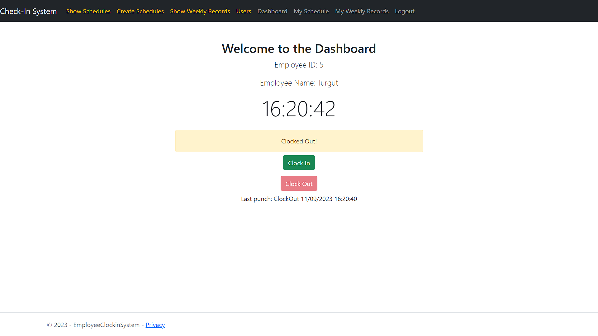
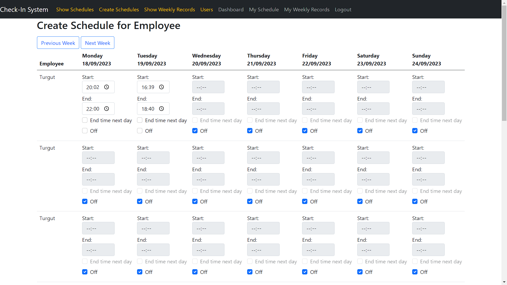
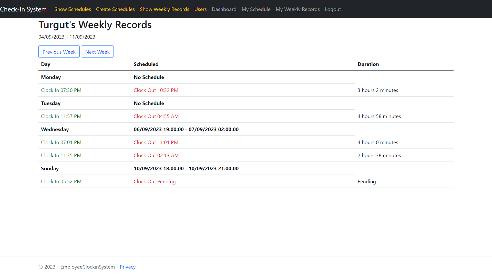

# Employee Clock-in System
The Employee Clock-in System provides an intuitive and streamlined way for employees to clock in and out, manage their schedules, and monitor their work hours. Built with a focus on location-based tracking, the system ensures employees can clock in and out only from predefined locations.

## Upcoming Updates
- The application will soon transition to a web API architecture.
- Several new features are
Manual record addition.
UI improvement.
Responsive design tailored for mobile devices.

## Core Features
- User Authentication and Role Management: Securely manage user access and roles.
- Location-based Clock-in & Clock-out: Ensure employees check-in only from authorized locations.
- Schedule Management: Define and modify employee schedules for admin/manager.
- Weekly Records: Employees can view their weekly work log with ease.

## Getting Started
Begin by setting up the database. This involves creating migrations and then updating the database.
Define your location in location service.
Post registration, ensure that users are designated as 'employee' by the manager or admin.

## Screenshots

